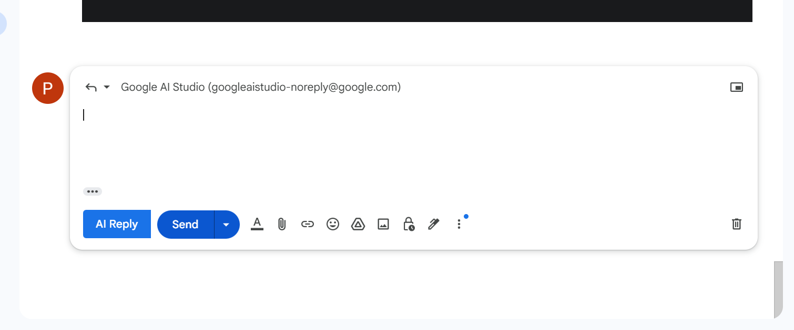
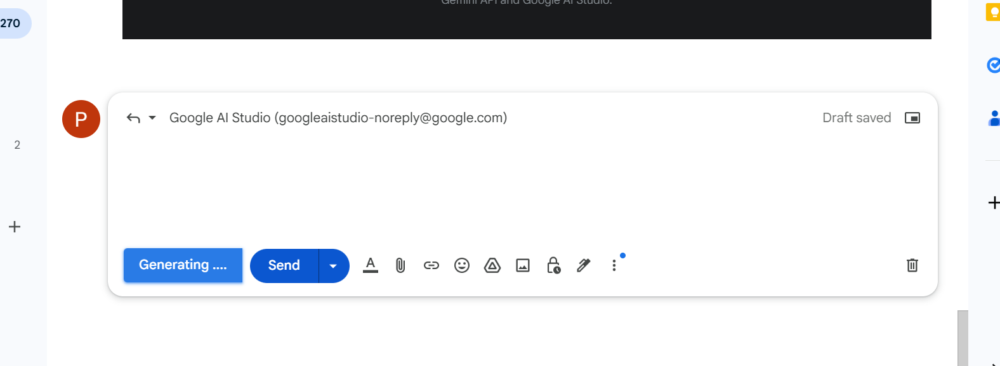
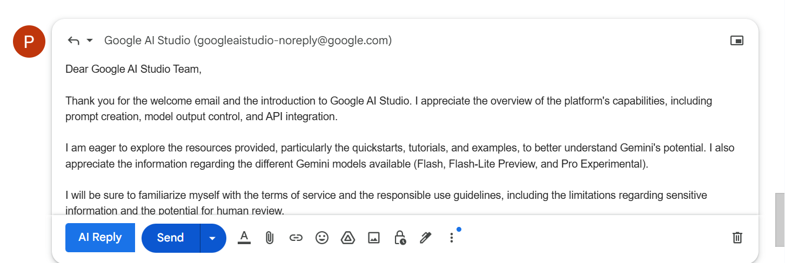

# Email Generator Application

## Overview
This is a simple AI-powered email generator application that uses **Google Gemini Flash 2.0** for generating responses. The backend is built with **Spring Boot**, while the frontend is developed using **React**. Additionally, the project includes a **Chrome extension** that seamlessly integrates with Gmail's reply functionality, enabling users to generate AI-powered responses based on the email content.

## Features
✅ Generate AI-powered email responses based on input text and tone selection.  
✅ Supports multiple tone options (e.g., Professional, Friendly, Neutral).  
✅ Chrome extension that integrates with Gmail's reply interface.  
✅ Option to leave the input blank and still receive a relevant AI-generated response.  
✅ Simple and intuitive UI for a smooth user experience.  

## Tech Stack
- **Frontend:** React, JavaScript, HTML, CSS
- **Backend:** Spring Boot, Java
- **AI Model:** Google Gemini Flash 2.0
- **Browser Extension:** Chrome Extension API, JavaScript
- **Deployment:** Docker (optional)

## Screenshots
### Web Application


### Tone Selection Feature


### Chrome Extension in Gmail
#### Integrated in Gmail's Reply Screen

#### Button when Response is getting generated

#### AI generated Response


## Installation & Setup
### Prerequisites
- Node.js & npm
- Java 17+
- Spring Boot
- Chrome Browser (for extension)

### Backend Setup
1. Clone the repository:
   ```sh
   git clone https://github.com/your-repo/email-generator.git
   cd email-generator/backend
   ```
2. Install dependencies and build the project:
   ```sh
   mvn clean install
   ```
3. Run the Spring Boot application:
   ```sh
   mvn spring-boot:run
   ```
4. The backend will be available at `http://localhost:8080`

### Frontend Setup
1. Navigate to the frontend folder:
   ```sh
   cd ../frontend
   ```
2. Install dependencies:
   ```sh
   npm install
   ```
3. Start the React app:
   ```sh
   npm start
   ```
4. Open `http://localhost:3000` in your browser.

### Chrome Extension Setup
1. Navigate to the extension folder:
   ```sh
   cd ../extension
   ```
2. Open Chrome and go to `chrome://extensions/`.
3. Enable **Developer Mode** (toggle at the top-right).
4. Click **Load unpacked** and select the `extension` folder.
5. The extension should now be available in Gmail's reply interface.

## API Endpoints
### 1. Generate Email Reply
**POST** `/api/email/generate`
- **Request Body:**
  ```json
  {
    "emailContent": "Hello, I need help with my order.",
    "tone": "professional"
  }
  ```
- **Response:**
  ```json
  {
    "generatedReply": "Dear Customer, Thank you for reaching out. We will assist you with your order shortly."
  }
  ```

## Contribution
Feel free to contribute! Open an issue or submit a pull request with improvements.

## License
This project is licensed under the MIT License.

---
### 🚀 Happy Emailing with AI! 🚀


